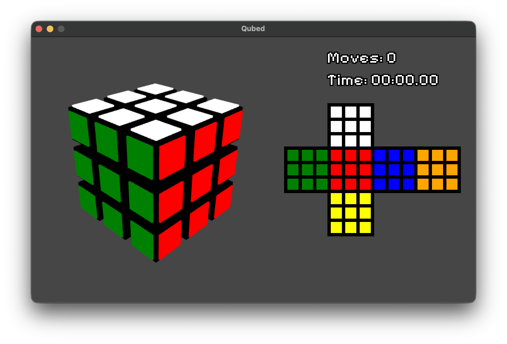
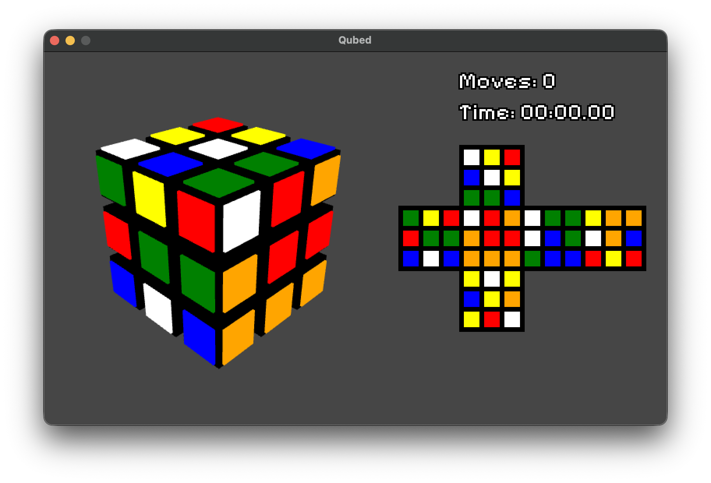
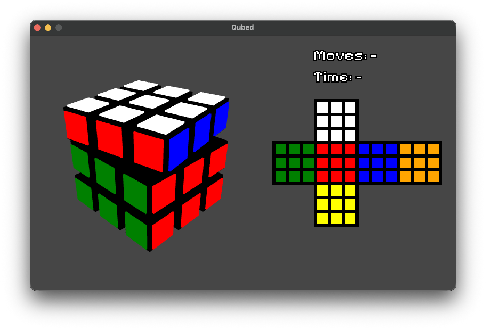

# Qubed. 3x3x3 Cube Game and Solver

Twist. Solve. Master.







## Controls

- Use the arrow keys or drag empty space with the left mouse button to orbit the cube.
- Click a cube face, or press `U`, `D`, `F`, `B`, `L`, or `R`, to animate a clockwise quarter turn of that face.
- Hold `Shift` while clicking a face or pressing a face key to animate the anticlockwise turn.
- Hold `Control` while clicking a face or pressing a face key to animate the half face turn.
- Press `Enter` to search for and animate a solution from the current cube state.
- Press `Esc` to exit.
- Press `Tab` to scramble.
- Press `Control` + `Z` to undo a move.
- Press `Control` + `Shift` + `Z` to redo a move.
- Press `H` to get help solving.

## Ideas

- Replay last solve.
  - Save scramble state.
  - Reset cube to it.
  - Play saved moves from solver.
- Invisible cube mode?
- Save points (not necessarily to disc, but maybe).
- Immediate solve button to skip to the end.
- Scramble, solve, repeat with stats.

## Notes

### Coordinates

All coordinates are (x, y) or (column, row).

### Faces

```
White  | Up
Yellow | Down
Red    | Front
Orange | Back
Blue   | Right
Green  | Left
```

### Net Layout

```
    +---+
    | U |
+---+---+---+---+
| L | F | R | B |
+---+---+---+---+
    | D |
    +---+
```

### Coordinates

```
                            U

                    (0,0) (1,0) (2,0)
                    (0,1) (1,1) (2,1)
                    (0,2) (1,2) (2,2)

        L                   F                   R                   B

(0,0) (1,0) (2,0)   (0,0) (1,0) (2,0)   (0,0) (1,0) (2,0)   (0,0) (1,0) (2,0)
(0,1) (1,1) (2,1)   (0,1) (1,1) (2,1)   (0,1) (1,1) (2,1)   (0,1) (1,1) (2,1)
(0,2) (1,2) (2,2)   (0,2) (1,2) (2,2)   (0,2) (1,2) (2,2)   (0,2) (1,2) (2,2)

                            D

                    (0,0) (1,0) (2,0)
                    (0,1) (1,1) (2,1)
                    (0,2) (1,2) (2,2)
```

### Colours

```
         U 

       W W W
       W W W
       W W W

  L      F      R      B

G G G  R R R  B B B  O O O
G G G  R R R  B B B  O O O
G G G  R R R  B B B  O O O

         D

       Y Y Y
       Y Y Y
       Y Y Y
```